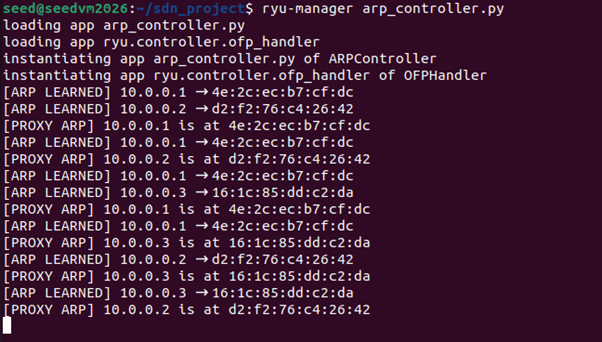
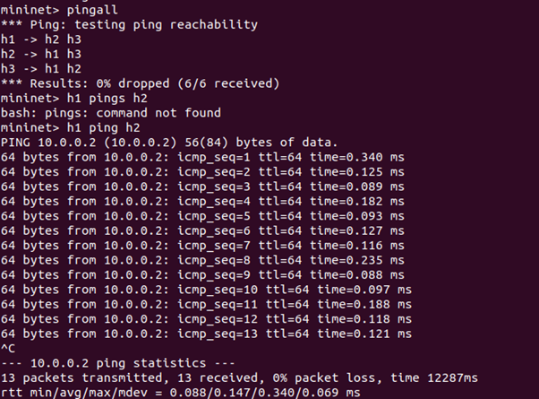
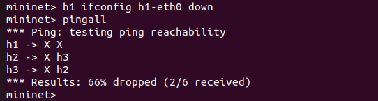
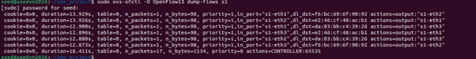

# SDN ARP Handling using Ryu and Mininet

## Problem Statement

The objective of this project is to implement ARP handling in a Software Defined Network (SDN) using a Ryu controller and Mininet.

In traditional networks, ARP requests are broadcast to all hosts, leading to unnecessary traffic. This project replaces broadcast-based ARP with a centralized approach using the SDN controller.

The controller learns IP-to-MAC mappings and responds directly to ARP requests using Proxy ARP, reducing network overhead.

## Objectives

- Implement SDN architecture using Mininet and Ryu
- Handle packet_in events in the controller
- Design match-action flow rules
- Implement Proxy ARP to reduce broadcast traffic
- Demonstrate network behavior using tools like ping and iperf

## Technologies Used

- Mininet (Network Simulation)
- Ryu Controller (SDN Controller)
- Open vSwitch (Switch)
- Python (Controller Logic)
- iperf (Performance Testing)
- ovs-ofctl (Flow table inspection)

## Network Topology

A simple single-switch topology is used:
```
h1 ----\
         \
h2 ------ s1 ------ Controller
         /
h3 ----/
```
## Setup and Execution

### Step 1: Start Controller
ryu-manager arp_controller.py

### Step 2: Start Mininet
sudo mn --controller=remote,ip=127.0.0.1,port=6653 --switch ovsk,protocols=OpenFlow13 --topo single,3

### Step 3: Test Connectivity
pingall

## Features Implemented

- MAC Learning (MAC → Port mapping)
- ARP Learning (IP → MAC mapping)
- Proxy ARP (Controller replies to ARP requests)
- Flow Rule Installation (match-action rules)
- Packet forwarding using SDN logic

## Test Scenarios

### Scenario 1: Normal Communication
All hosts communicate successfully using pingall.
The controller learns ARP mappings and responds using Proxy ARP.

### Scenario 2: Failure Case
One host interface is turned off:
h1 ifconfig h1-eth0 down

Result:
Communication fails, demonstrating correct network behavior under failure conditions.

## Output / Results

- ARP learning observed in controller logs
- Proxy ARP responses successfully generated
- All hosts communicate successfully (0% packet loss)
- Flow rules installed in switch
- Throughput measured using iperf

## Performance Analysis

### Latency (Ping)
Ping is used to verify connectivity between hosts.

### Throughput (iperf)
iperf is used to measure TCP bandwidth between hosts:

h2 iperf -s &
h1 iperf -c 10.0.0.2

This confirms successful data transfer under SDN control.

### Flow Table Inspection
Flow rules installed in the switch are inspected using:

sudo ovs-ofctl -O OpenFlow13 dump-flows s1

## Screenshots / Proof of Execution

### ARP Learning & Proxy ARP
Shows controller learning IP-MAC mappings and replying using Proxy ARP.



### Normal Communication
All hosts communicate successfully (0% packet loss).



### Failure Scenario
One host is disabled, resulting in packet loss.



### Throughput using iperf
Shows bandwidth between hosts.


### Flow Table
Shows match-action rules installed in switch.



## Conclusion

This project demonstrates how SDN can improve network efficiency by centralizing ARP handling.

By implementing Proxy ARP in the controller, broadcast traffic is reduced and network behavior becomes more controlled and efficient.
